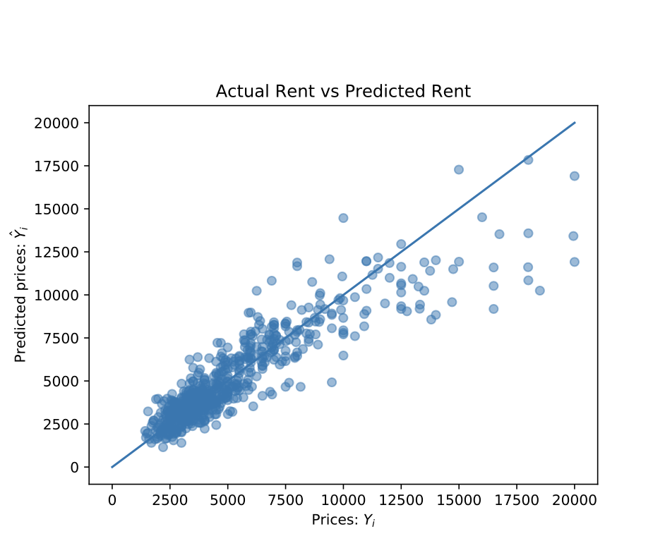

# HousingPricesPredictor
This is a problem solved using Multiple Linear Regression Using a dataset from a Manhattan bases firm StreetEasy. The model has a R**2 value of 0.8088 on the testing data set.

StreetEasy is New York City’s leading real estate marketplace — from studios to high-rises, Brooklyn Heights to Harlem.

I have used a dataset that contains a sample of 5,000 rentals listings in Manhattan, Brooklyn, and Queens, active on StreetEasy in June 2016.
 The results: 

